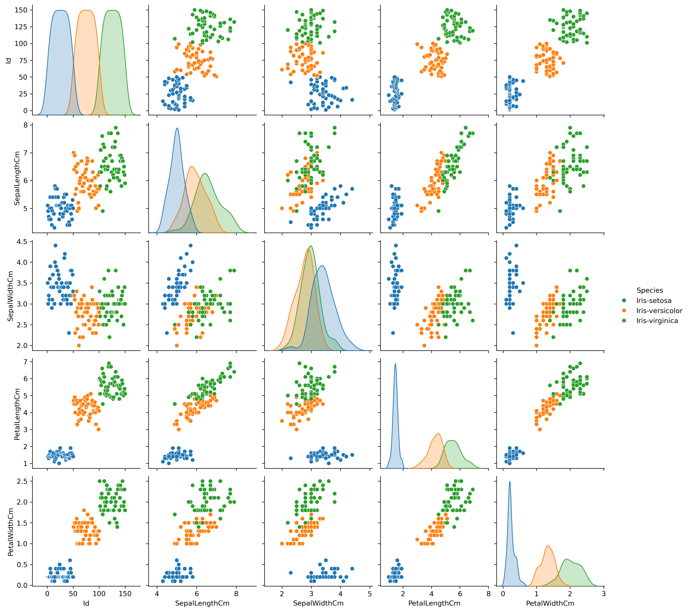

# Iris Dataset Analysis

  *(Replace with your actual visualization)*

## Overview
Exploratory Data Analysis (EDA) of the classic Iris flower dataset, analyzing sepal/petal measurements across three species (*Iris-setosa*, *Iris-versicolor*, *Iris-virginica*). This project demonstrates:
- Data cleaning and statistical analysis.
- Visualization techniques (scatter plots, histograms, box plots).
- Species classification insights.

## Key Insights
1. **Species Differentiation**:
   - *Setosa* has distinctly smaller petals (1–2 cm length) and wider sepals compared to other species.
   - *Virginica* has the largest petals (4–7 cm length) and longest sepals.
   - Petal measurements (`PetalLengthCm`, `PetalWidthCm`) are the most reliable features for classification.
   
2. **Statistical Findings**:
   - Strong positive correlation between petal length and width (`r = 0.96`).
   - Bimodal distributions in petal measurements reveal clear species groupings.
   
3. **Outliers**: 
   - One potential outlier in *Virginica* sepal width (4.4 cm).

## Code & Libraries Used
```python
import pandas as pd      # Data manipulation
import seaborn as sns    # Advanced visualizations
import matplotlib.pyplot as plt  # Basic plotting
from sklearn.preprocessing import StandardScaler  # (Optional: if you used scaling)
